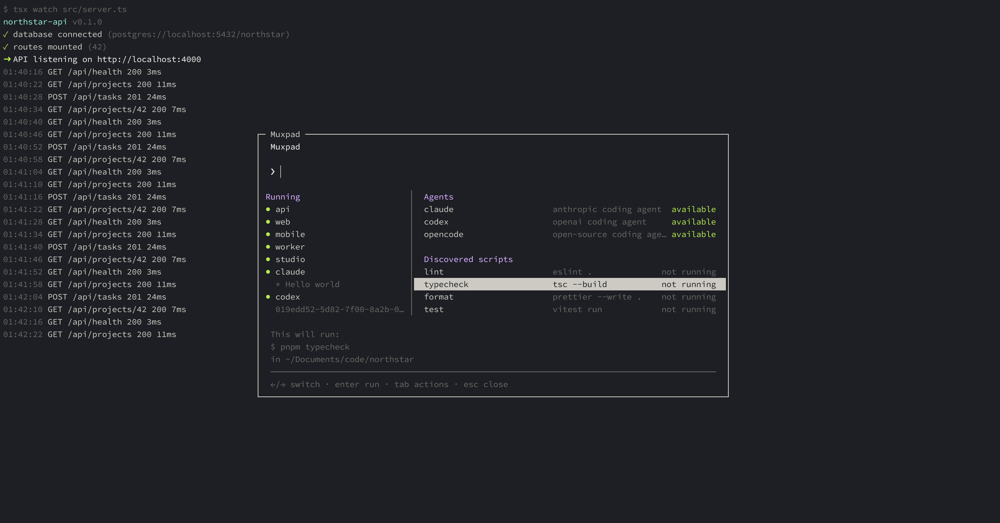

<p align="center">
  
</p>

<p align="center">
    A project-aware command palette and launcher for tmux and Herdr.
</p>

# About

Muxpad puts your configured project tasks, discovered package scripts, and
coding agents in a fuzzy-searchable menu, so you can quickly launch, find, and
switch between them. It runs as a standalone tmux tool and as a plugin for
[Herdr](https://herdr.dev).

<p align="center">
  
</p>

I built Muxpad for my own workflow: managing dev servers, workers, databases,
test watchers, and coding agents across several repositories. tmux and Herdr
both handle these processes well, but repeatedly creating, naming, and finding
the corresponding windows and panes gets tedious. Muxpad automates that
bookkeeping without replacing the tools underneath.

## How it works

A key binding opens the palette for the current project. It lists your
configured tasks and the package scripts discovered from the root `package.json`
and workspace packages. From there you can launch an entry, focus one that is
already running, or choose where it should open. A live sidebar lists running
tasks so you can find and return to them.

Muxpad is a thin layer over whichever multiplexer you use. On tmux it creates and
locates ordinary sessions, windows, and panes. As a Herdr plugin it opens the
palette and a project launcher as Herdr overlay panes and manages Herdr
workspaces and panes. Both share the same project and task model.

## Setup

Follow the guide for the tool you use:

- [Muxpad on tmux](docs/tmux.md): build the `muxpad` binary and add a tmux
  binding.
- [Muxpad on Herdr](docs/herdr.md): build the `muxpad-herdr` binary and link the
  plugin.

## Requirements

- Go 1.26 or newer to build from source
- tmux 3.3 or newer, for the tmux path
- Herdr 0.7.1 or newer, for the Herdr plugin

## Tests

```sh
go test ./...
```

The original Ruby prototype is kept temporarily under `ruby/` (with its own
parity suite) while the Go port is validated.
